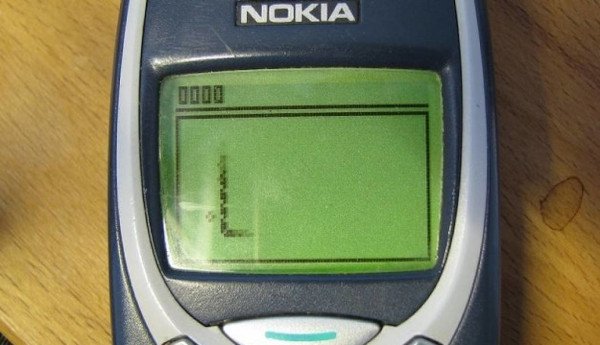
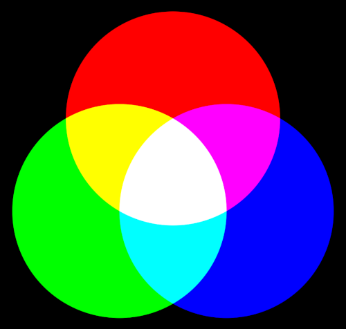
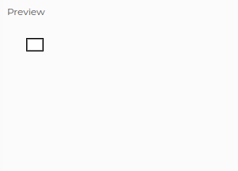
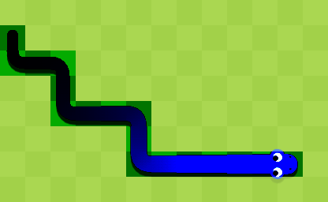
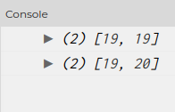
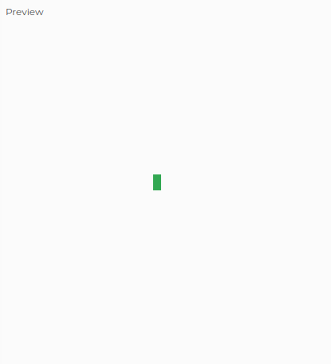
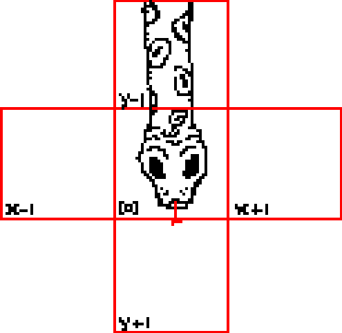
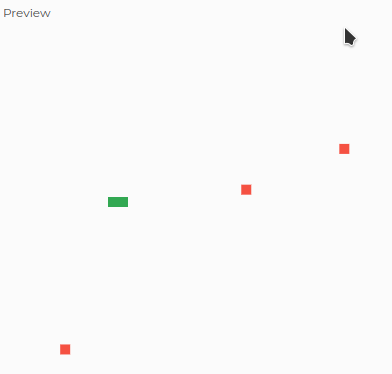
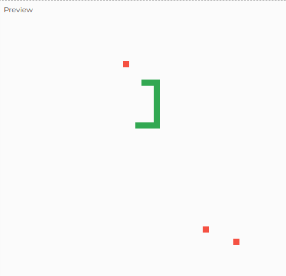

# Snake

## Introduction

Vous avez déjà probablement entendu parler du jeu de **Snake** ! 🐍



Pour ceux qui ne connaissent pas, c'est un jeu tout simple qui consiste à
contrôler un serpent qui doit manger les pommes présentes sur une zone
délimitée 🍎

Le jeu a été popularisé sur un téléphone portable nommé le Nokia 3310, connu
mondialement pour sa durée de vie, sa solidité et surtout ses mélodies
stridentes 🎶

Vous pouvez jouer au jeu Snake [ici](https://g.co/kgs/sNwKmN) si vous souhaitez
essayer par vous-même !

Et c'est ce que vous allez essayer de réaliser aujourd'hui -- accrochez vos
ceintures et c'est parti ! 🤪

## Prérequis

Pour réaliser cette activité, vous aurez besoin d'une seule chose : c'est
d'ouvrir l'éditeur [p5js](https://editor.p5js.org/) en ligne !

Cette bibliothèque permet de réaliser des opérations graphiques tel que du
dessin, du traitement d'images et bien plus en utilisant le JavaScript comme
base de langage de programmation.

Si vous n'avez jamais fait de JavaScript avant, ne vous inquiétez pas - la
syntaxe est relativement simple à prendre en main et nous sommes ici pour vous
aider ! 😄

## Prise en main de l'éditeur


L'éditeur est composé de trois grandes parties :

1. Une barre de menus, qui permet l'exécution et l'arrêt du script en cours
2. Une zone à gauche qui permet de développer le script actuel
3. Une zone à droite qui permet de voir le résultat du script en cours
   d'exécution
4. Une zone en bas à gauche qui contient une petite console sur laquelle vous
   pourrez afficher du texte ou des informations avec la fonction `console.log`

Vous avez aussi un case à cocher « Auto-refresh » qui permet de mettre à jour en
temps réel le côté droit de l'éditeur si vous modifiez le code source, ce qui
peut s'avérer très pratique durant la réalisation de cet activité. Pensez donc
à le **cocher** ! ✅

## Réalisons l'activité

### C'est quoi ces fonctions ?

Vous aurez très certainement remarqué que, lorsque vous avez ouvert l'éditeur
p5js, vous avez aperçu le code source suivant, à gauche de l'éditeur :

```js
function setup() {
  createCanvas(400, 400);
}

function draw() {
  background(220);
}
```

Avant de savoir tout de suite ce que ce code veut dire, essayez de comprendre
par vous-même ce que ce code réalise ! 🧙

<details><summary>Voir la solution</summary>

Alors, vous avez un peu deviné à quoi cela servait ? 🤔

Décomposons le code en plusieurs parties :

- ```js
  function setup() {
    ...
  }
  ```
  
  Tout d'abord, nous avons une déclaration de fonction -- c'est à dire que
  nous informons JavaScript que nous créons une fonction qui n'existe pas
  encore, appelée `setup`.
  
  Dans le contexte de p5js, cette fonction est utilisée par p5js pour
  initialiser tout ce qui est **nécessaire** : les variables, d'autres modules
  complémentaires, ou ici le `canvas` 🎨
  
  Le `canvas`, ou « tableau » en français, désigne la partie droite de
  l'éditeur que nous avons présenté préalablement. C'est ici que toutes les
  opérations graphiques seront dessinées 🖍️
  
  Les accolades (`{` et `}`) englobent le contenu de la fonction, c'est à dire
  le code qui va être exécuté à chaque fois que la fonction va être utilisée.
  On réfère communément cette démarcation par **le corps de la fonction**.
- ```js
  createCanvas(400, 400);
  ```
  
  Cette ligne indique à p5js que nous souhaitons **créer** un tableau d'une
  taille de **400** pixels par **400** pixels.
- ```js
  function draw() {
    ...
  }
  ```
  
  Nous déclarons enfin une seconde fonction, appelée `draw`. Cette dernière
  sera appelé par p5js à **intervale régulière**.
  
  Le corps de cette fonction contiendra toutes les opérations nécessaires au
  dessin ; vous pouvez donc dessiner ici des rectangles, des cercles, etc.
- ```js
  background(220);
  ```
  
  Cette ligne indique à p5js de remplir le tableau avec une couleur grise.
  Étant donné que l'on a spécifié qu'un seul argument à cette fonction, p5js
  se contente d'utiliser cette valeur pour les composantes rouge, vert et
  bleu.
</details>

### Comment ça marche, un écran ?

Nous savons tous qu'un écran est capable d'afficher n'importe quel couleur, et
même n'importe quelle forme ou image. 🖼️

Mais, savez-vous comment un écran affiche-t-il toutes ces couleurs ?

Vous savez très certainement qu'en peinture et en art, les couleurs ne sont
qu'un « assemblage » de quantités de couleurs primaires que sont le bleu, le
magenta et le jaune.


Le violet 🟣, par exemple, est un assemblage des couleurs rouge 🔴 et bleu 🔵.

En informatique, c'est exactement la même chose -- sauf qu'au lieu d'avoir les
couleurs primaires bleu, magenta et jaune, nous avons plutôt du rouge, du bleu
et du vert !



Oui, les couleurs sont flashy 😵‍💫 -- mais c'est cependant nécessaire pour obtenir
un spectre très varié de couleurs ! 🌈

Un écran est aussi composé de pixels qui, lorsque l'on les assemble, permettent
de pouvoir reproduire n'importe quelle forme que l'on souhaite. En d'autres
termes, tout ce que vous voyez à l'écran sont en permanance des illusions
d'optique ! 🫣

### Prenons en main la bibliothèque p5js !

Avant de nous atteler à créer un clone du jeu de Snake, essayons tout d'abord
de prendre en main la bibliothèque p5js !

Une resource que nous vous recommandons **fortement** d'utiliser est [la
référence de p5js](https://p5js.org/reference/). Cette page contient toutes les
fonctions utilisables dans votre code JavaScript, et donc vous permettra
d'avancer plus rapidement ! 🥳

#### Dessinons un rectangle !

##### L'objectif

Nous allons tout d'abord essayer de dessiner un rectangle sur le tableau !

Pour se faire, il va nous falloir savoir :

- où dessiner le rectangle sur le tableau 🔍
- la taille de ce rectangle 📏

##### Le système de coordonnées

Il faut savoir que pour savoir **où** dessiner quoi que ce soit, la plupart des
programmes et bibliothèques informatiques utilisent un système de coordonnées
appelé **carthésien**.

Voici un exemple pour que vous comprenez le principe :


- Tout point est exprimé sous la forme $(x, y)$.
- La coordonnée d'origine $(0, 0)$ correspond au plus haut et à l'extrémité la
- plus à gauche de l'écran.
- Lorsque la partie $x$ augmente, le point avance de plus en plus vers la droite
- Lorsque la partie $y$ augmente, le point descend de plus en plus vers le bas
- L'image de cochon 🐷 ici présent est encadré par un rectangle placé en
  $(30, 10)$

Si vous n'avez pas très bien compris, n'hésitez pas à demander à un encadrant de l'aide ! 🎓

##### La pratique

Bien, après la théorie, la pratique ! 😉

Farfouillez [la référence de p5js](https://p5js.org/reference/) pour trouver une
fonction qui permet de dessiner un rectangle en $(30, 20)$ et de taille $20$ par
$15$ pixels.

Rappelez-vous que le corps de fonction `draw` sert à placer les instructions
nécessaires au dessin.

Bonne chance ! 👍

<details><summary>Voir la solution</summary>
Alors, vous avez réussi ? 🤠

Si c'est le cas, vous devriez obtenir le code ci-dessous pour la fonction
`draw` :

```js
function draw() {
  rect(30, 20, 20, 15);
}
```

Ce qui donne ceci sur le côté droit de l'éditeur :


</details>

Essayez de changer la couleur du rectangle, de dessiner plusieurs rectangles,
ou même de dessiner d'autres formes ! ⭕🔳🔼

#### Comment un serpent est-il constitué ?

Dans le jeu du Snake, un serpent est simplement composé de plusieurs « blocs »,
comme on peut le voir ci-dessous :



Notre jeu doit donc savoir déjà où sont ces blocs : il nous faudra donc une
liste pour stocker ces différentes positions ! 🗒️

#### Créons la liste des segments du serpent

Créons donc une liste des segments appelé `snake_set` que l'on définira de la
manière ci-dessous, de sorte à ce que la fonction `setup` ressemble à ceci :

```js
function setup() {
  createCanvas(400, 400);

  snake_set = [];
}
```

Cette liste contiendra des positions, qui sont en réalité eux-même des listes de
deux éléments $x$ et $y$.

Nous allons pré-remplir la liste `snake_set` de deux éléments qui va contenir
le tout début de notre serpent :

```js
// Juste après `snake_set = []`

snake_set.push([19, 19]);
snake_set.push([19, 20]);
```

Comme vous l'aurez compris, la fonction `push` associée à `snake_set` permet
d'ajouter un élément spécifié à la liste.

Nous utiliserons le premier élément de la liste comme la **tête** du serpent.

#### Pourquoi des coordonnées aussi petites ?

Vous l'aurez très certainement remarqué, mais entre $(19, 19)$ et $(19, 20)$, il
n'y a qu'un seul pixel de différence. 🤔

Cependant, rien nous empêche de dire que ces coordonnées là ne représentent pas
forcément des pixels sur l'écran, mais plutôt des carrés sur l'écran.

Nous nous contenterons de dire qu'un carré est de taille 10 pixels par 10
pixels, donc nous devrons dessiner des *rectangles* de 10 par 10 auquel nous
aurons multiplié leurs composantes $x$ et $y$ de coordonnées par 10 !

En multipliant par 10, nous établissons que :

- le carré en $(0, 0)$ se place réellement en $(0, 0)$
- le carré en $(0, 1)$ se place réellement en $(0, 10)$
- le carré en $(1, 0)$ se place réellement en $(10, 0)$
- etc.

... ce qui fait que nous avons de gros « pixels », d'une certaine façon 😛

#### Dessinons cette liste

Afin d'afficher le serpent, nous devons donc maintenant **itérer** sur la liste 
`snake_set`.

Cela veut dire que nous souhaitons, pour chaque élément dans la liste, faire
quelque-chose avec. Fort heureusement pour nous, il existe une fonction pour
ça ! 🎉

Voici un exemple pour que vous comprenniez comment l'utiliser :

```js
snake_set.forEach((element) => {
  console.log(element);
});
```

Ce code ci-dessus va afficher chaque élément présent dans la liste `snake_set`
sur la console de l'éditeur !



Pour accéder à un élément d'une liste, il suffit de faire ceci :

```js
element[0] // premier élément
element[1] // second élément
```

Essayez d'expérimenter en faisant des `console.log` depuis la fonction `setup`,
et avec la boucle `forEach` que nous avons présenté un peu plus haut.

Une fois cela fait, essayez de construire une boucle qui va afficher chaque
carré à partir des coordonnées de la liste `snake_set`. N'hésitez pas à demander
aux autres comment faire, avant de vous jeter sur la solution ! 🤪

<details><summary>Voir la solution</summary>
Alors attention, si vous regardez juste parce que vous avez la flemme de trouver
par vous-même, on vous jugera jusqu'à la fin de la séance ! 😠

Voici comment procéder, toujours depuis la fonction `draw` :

```js
snake_set.forEach((element) => {
  rect(element[0] * 10, element[1] * 10, 10, 10);
});
```

Ce code va ainsi, pour chaque élément (et donc coordonnée) dans `snake_set`,
dessiner un rectangle selon les coordonnées spécifié de cet élément là.

Cela devrait donner quelque-chose comme ceci :


</details>

N'hésitez surtout pas à changer la couleur des rectangles en consultant
[la référence de p5js](https://p5js.org/reference/), un jeu doit d'être joli à
regarder ! 🧐

Par exemple, j'ai personnellement fait en sorte à ce que le serpent soit de
couleur verte et qu'il n'ait aucune bordure :

```js
fill(50, 168, 82);
noStroke();
```



#### Faisons déplacer le serpent

C'est bien beau de dessiner un serpent, mais si ce dernier ne bouge pas, ce
n'est alors pas un jeu ! 

Nous allons rajouter une fonction `keyPressed` qui, à chaque fois qu'elle est
appelée, indique au script qu'une touche a été pressée :

```js
function keyPressed() {
  ...
}
```

Dans cette fonction, vous avez accès à la variable `keyCode` auquel vous pouvez
vérifier sa valeur pour savoir quelle touche a été pressée.

Nous allons tout d'abord déclarer une nouvelle variable dans la fonction `setup`
qui va nous permettre de savoir dans quelle direction le serpent doit se
déplacer à chaque fois, si l'on n'appuie sur une aucune touche :

```js
snake_set = ...;
snake_direction = "up";
```

Comme vous l'aurez compris, `snake_direction` peut contenir `up` (haut),
`down` (bas), `left` (gauche) ou `right` (droite). Pour le moment, cette
variable ne change pas de valeur, mais nous allons tout de suite faire en sorte
à ce que ce soit le cas ! 🕹️

Pour vous aider, nous vous avons fait un petit tableau pour vous aider à savoir
quelles constantes sont à comparer avec `keyCode` :

 `keyCode`     | Valeur à assigner à `snake_direction` | Direction
---------------|---------------------------------------|-----------
 `LEFT_ARROW`  | `"left"`                              | Gauche
 `RIGHT_ARROW` | `"right"`                             | Droite
 `UP_ARROW`    | `"up"`                                | Haut
 `DOWN_ARROW`  | `"down"`                              | Bas

<details><summary>Comment fait-on un `if` ?</summary>
Pour ceux qui ne savent pas, un `if` ressemble à ceci :

```js
if (...) {

}
```

C'est un bloc de code qui exécutera son corps (vous savez, tout ce qui est
englobé avec des accolades !) **que** si l'expression entre parenthèses (ce qui
est désigné avec des `...`) est vraie (`true`)

Par exemple, il est vrai que `1 == 1`, mais cela n'aurait pas d'intérêt étant
donné que cela est toujours vrai. C'est pour cela que, la plupart du temps, la
vérification d'identité se réalise toujours avec une variable :

```js
if (lives > 0) {
  console.log("Vous êtes vivant !");
}
```

Ce que vous voyez ici, ainsi que `1 == 1`, est ce que l'on appelle des
**comparaisons** qui indique si cela est `true` (vrai) ou `false` (faux).

Vous pouvez utiliser les opérateurs `==` (égalité), `<` (plus petit que),
`>` (plus grand que), `<=` (plus petit que ou égal) et `>=` (plus grand que ou 
égal) et même `!=` (inégalité) pour faire des comparaisons.

Vous pouvez écrire une suite de `if`s de cette manière là :

```js
if (lives > 0) {
  ...
}
if (lives == 0) {
  ...
}
```

Si vous souhaitez tester une variable avec plusieurs valeurs, vous pouvez très
bien faire ceci :

```js
if (lives > 0) {
  // La condition `lives > 0` est vraie, `lives = 1` par exemple
  ...
} else if (lives == 0) {
  // La condition `lives == 0` est vraie car `lives = 0`
  ...
} else {
  // Ce bloc de code est exécuté QUE si tous les autres comparaisons ont donné `faux`
  ...
}
```

Il existe bien évidemment d'autres façons de réaliser des comparaisons, mais
pour la simplicité de cette activité, nous n'allons pas en parler ici. 📕

N'hésitez surtout pas à faire vos recherches de votre côté cependant, c'est
toujours bon pour la culture générale ! 🤪
</details>

Il ne vous reste plus qu'à faire les conditions nécessaires pour pouvoir
changer la valeur de la variable à chaque fois qu'une touche de direction est
pressée ! Bonne chance !

Vous pouvez ensuite tester si votre code fonctionne en écrivant juste en dessous
un petit `console.log(snake_direction)` dans le corps de la fonction. Si,
dans la console, une ligne s'affiche à chaque fois que vous appuyez sur les 
touches de direction **et** que la touche correspond à ce qui est affiché dans$
la console, vous avez réussi ! 😁

**Attention** : Pensez à cliquer sur la zone à droite pour que vos touches de
clavier soient prises en compte, sans quoi vous allez presser des touches dans
le vide ! ⚠️

N'hésitez pas surtout à demander de l'aide si vous êtes bloqué ! 🗒️

<details><summary>Voir la solution</summary>
Voilà ce que vous devriez obtenir une fois que vous avez terminé d'écrire votre
code :

```js
function keyPressed() {
  if (keyCode == UP_ARROW) {
    snake_direction = "up";
  } else if (keyCode == DOWN_ARROW) {
    snake_direction = "down";
  } else if (keyCode == LEFT_ARROW) {
    snake_direction = "left";
  } else if (keyCode == RIGHT_ARROW) {
    snake_direction = "right";
  }
}
```
</details>

Maintenant que les touches de direction réagissent et modifient la variable
`snake_direction`, nous n'avons plus qu'à réagir **périodiquement** à cette 
dernière.

Pour se faire, nous disposons de la fonction `setInterval` que nous pouvons
utiliser de cette manière là :

```js
setInterval(() => {
  ...
}, 1234);
```

Comme vous pouvez l'observer, on utilise une fonction comme le corps du code qui
va s'exécuter périodiquement, et l'on spécifie que ce code doit s'exécuter tous
les `1234` millisecondes. ⏲️

Essayez de l'utiliser dans `setup` et regardez par vous même avec des appels à
`console.log` -- faites vos propres petites expérimentations ! 🧪

On va ainsi pouvoir utiliser cet outil pour pouvoir faire déplacer notre serpent
de manière périodique. Nous recommandons de mettre la fréquence d'exécution à
`250` millisecondes, soit un quart de seconde ; mais vous pouvez très bien
prendre une période plus courte ou plus longue ! ⌛

Nous avons donc besoin de faire les choses suivantes :

- Déterminer la prochaine coordonnée où sera placé la tête du serpent à partir
  de la valeur stockée dans `snake_direction` et de la tête (le premier élément
  de la liste `snake_set`)
- Empêcher le joueur de partir dans une direction opposée, sans quoi le serpent
  pourra avancer sur lui-même
- Faire déplacer les différents segments du serpent de sorte à ce que l'on ait
  le résultat ci-dessous
  
  Pour une liste contenant les éléments `T`, `A`, `B` et `C` :

   0 | 1 | 2 | 3
  ---|---|---|---
   T | A | B | C

  On devrait obtenir après l'opération une liste de cette forme :

   0 | 1 | 2 | 3 
  ---|---|---|---
   N | T | A | B 

Nous allons voir tout ceci dans les prochaines partie de cette activité ! 👍

##### Déterminer la prochaine coordonnée où sera placé la tête du serpent

Toujours dans le corps de la fonction déclaré pour `setInterval`, la prochaine
étape consiste à faire bouger, selon la direction auquelle le joueur souhaite se
déplacer, la tête du serpent 🐍

Ce n'est qu'une question de comparaisons avec `snake_direction` et de tout
petits calculs avec la tête actuelle du serpent, mais voici un petit schéma pour
vous aider :



- Le `[0]` correspond au premier élément de la liste de `snake_set`, soit la
  tête du serpent
- Les `x - 1`, `x + 1`, `y - 1` et `y + 1` réfèrent aux coordonnées
  **relatives** aux coordonnées du serpent. Par exemple, `x - 1` signifie 
  réellement `[snake_set[0][0] - 1, snake_set[0][1]]`

On vous recommande de stocker préalablement le résultat dans une variable pour
la prochaine étape 👍

Si vous n'y arrivez pas, demandez de l'aide à quelqu'un avant de voir la
solution ! 🫡

<details><summary>Voir la solution</summary>
Voici un moyen de parvenir à ce résultat là :

```js
next_direction = null;
if (snake_direction == "up") {
    next_direction = [snake_set[0][0], snake_set[0][1] - 1];
} else if (snake_direction == "down") {
    next_direction = [snake_set[0][0], snake_set[0][1] + 1];
} else if (snake_direction == "left") {
    next_direction = [snake_set[0][0] - 1, snake_set[0][1]];
} else if (snake_direction == "right") {
    next_direction = [snake_set[0][0] + 1, snake_set[0][1]];
}
```

Comme vous pouvez le constater, on calcule la nouvelle position de la tête à
partir de celle actuelle en utilisant les composantes de la coordonnée
`snake_set[0]`.
</details>

##### Faire déplacer le serpent

Une fois cela fait, il ne reste plus qu'à déplacer la tête et le reste du corps
du serpent. Pour se faire, il va falloir d'abord enlever le dernier élément de
la liste `snake_set`, puis ajouter au début (c'est à dire à l'index `0`) la
position de la nouvelle tête.

Il existe deux fonctions associées aux listes en JavaScript pour réaliser ce que
l'on souhaite faire :

- `pop` : cette fonction permet d'enlever le dernier élément de la liste et la
  renvoie à l'utilisateur (ce sera très utile vers la fin...! 💡)
- `unshift(élément)` : cette fonction permet d'ajouter l'élément spécifié en
  début de liste

Il ne nous reste plus qu'à réaliser ces deux opérations sur la liste
`snake_set` ! La fameuse variable stocké dans l'étape précédente sert à ça !

Vous devriez ainsi voir le serpent se déplacer de case en case, et selon la
direction que vous souhaitez prendre avec les touches fléchés !

Si votre serpent semble s'allonger au fur à mesure à ce que vous avanciez, c'est
tout à fait normal : vous n'avez pas encore demandé à p5js d'effacer l'écran à
chaque fois, ce qui fait qu'il dessine par dessus ce qu'il avait déjà dessiné !

Vous n'avez qu'à rajouter `clear(255)` au début du corps de la fonction `draw` 
pour régler ce problème ! 🐛

##### Empêcher le serpent de se déplacer sur lui-même

Vous l'aurez peut-être remarqué, mais le serpent peut passer sur lui-même
lorsque l'on lui donne une direction opposée à celle auquelle il avance ! 🤔

Par exemple, vous pouvez aller vers la droite... puis vers la gauche ! Un vrai
serpent accrobatique, mais ce n'est pas ce que l'on veut 🐍

Encore une fois, ce n'est qu'une histoire de conditions ! Il suffirait juste
de stocker la direction prise par le serpent, ou « acceptée » si vous préférez,
et de vérifier ensuite dans le code où l'on assigne une direction à partir d'une
touche, si la dernière direction acceptée est à l'opposé de la direction prise
par le serpent !

Il existe en JavaScript un opérateur `&&` qui permet de vérifier plusieurs
conditions dans un seul `if` -- ce sera votre meilleur allié pour cette
situation là 🎇

<details><summary>Voir la solution</summary>
Alors, vous avez trouvé ou pas ? 👀

Voici ce qu'il faut faire :

- On stocke cette direction après avoir `pop` et `unshift` la liste `snake_set`
- Dans le code de la fonction `keyPressed`, on vérifie que
  - Si la touche `UP_ARROW` est pressée **et** que `snake_direction`
    **n'est pas** `down`, alors `snake_direction = "up"`
  - Si la touche `DOWN_ARROW` est pressée **et** que `snake_direction`
    acceptée **n'est pas** `up`, alors `snake_direction = "down"`
  - La même chose pour gauche (`LEFT_ARROW`) et droite (`RIGHT_ARROW`)

On sait très bien que des gens vont **forcément** que copier coller le code,
alors cette fois-ci on ne vous laisse pas de choix que de le faire ! 😈

Pour vous aider, le `&&` s'utilise de cette manière là :

```js
if (1 == 1 && lives > 3) {
  // Ce code ne s'exécutera que si 1 est égal à 1 et que lives est plus grand
  // que 3
  ...
}
```
</details>

Vous avez ainsi réglé un problème, houra ! 💥

#### Placer des pommes sur la carte

Nous avons maintenant un serpent qui se déplace dans la zone, mais nous n'avons
pas encore de nourriture pour le faire grossir ! 🍏

Dans le corps de la fonction `setup`, nous allons tout d'abord créer une liste 
appelée `apple_set` qui va contenir les coordonnées de chaque pomme.

Ensuite, nous allons remplir cette liste de sorte à ce qu'il y ait **3**
coordonnées, ces derniers représentant les positions de chaque pomme sur la
zone.

##### Une histoire de boucles

Nous allons donc devoir faire une boucle `for`, semblable à `forEach`, sauf que
cette fois-ci nous allons devoir spécifier **un nombre de fois** au lieu d'une
liste, puisque nous n'avons pas encore les éléments de la liste `apple_set`
remplie.

Voici la syntaxe à utiliser :

```js
for (i = 0; i < N; i++) {
  ...
}
```

`N` représente le nombre de fois que vous souhaitez exécuter le code présent
dans le corps de la boucle.

Voici un exemple :

```js
for (i = 0; i < 3; i++) {
  console.log(i);
}

// Console :
// 1
// 2
// 3
```

##### Générons des coordonnées aléatoires !

Nous allons aussi utiliser une autre fonction nous permettant de générer des
nombres aléatoires dans une intervalle donnée : c'est bien la fonction
`random(a, b)` !

Alors attention, `random(a, b)` génère des nombres **à virgule**, il est donc
impératif d'englober son résultat dans `Math.floor(x)`, une fonction qui permet
d'obtenir uniquement la partie entière du résultat donné.

Par exemple, si l'on réalise `Math.floor(3.14)`, la fonction nous renverra `3`.

Nous allons donc nous en servir pour générer des coordonnées aléatoires. La
taille de la carte est de 40 par 40 blocs, mais les coordonnées commencent à
`0` -- nous devrons donc générer des composantes $x$ et $y$ dans l'intervale
$(0, 39)$ :

```js
[Math.floor(random(0, 39)), Math.floor(random(0, 39))]
```

Il ne reste plus qu'à **pousser** chaque coordonnée dans la liste `apple_set`.

Allez, vous pouvez y arriver ! 🫡

<details><summary>Voir la solution</summary>
Il suffit juste de combiner l'exemple juste au dessus et l'exemple d'avant pour
obtenir ceci :

```js
for (i = 0; i < 3; i++) {
  apple_set.push([Math.floor(random(0, 39)), Math.floor(random(0, 39))]);
}
```

Vous avez désormais une liste de coordonnées qui se génère aléatoirement à
chaque fois que le script démarre 😄
</details>

##### Affichons maintenant ces pommes

Actuellement, nous avons une liste de pommes, mais nous ne les affichons pas
encore... mais pas pour longtemps !

En reprenant le code utilisé pour afficher le serpent, vous pouvez afficher les
pommes à la place.

Pensez à changer la couleur des blocs, sinon vous allez confondre le serpent
avec les pommes 🧐

<details><summary>Voir la solution</summary>
Voici un exemple de ce que l'on pourrait écrire :

```js
fill(245, 81, 66);
apple_set.forEach((element) => {
  rect(element[0] * 10, element[1] * 10, 10, 10);
});
```

Comme on peut le voir ici, c'est exactement le même code que celui utilisé pour
afficher les blocs composant le serpent 🤠
</details>

Vous devriez finalement obtenir ceci :



#### Mangeons les pommes sur la carte !

Il ne nous reste plus beaucoup de choses à implémenter ! La prochaine étape est
de vérifier si la tête du serpent (pour rappel `snake_set[0]`) touche l'une des
pommes.

Voici une ébauche d'instructions logiques :

- Pour chaque élément `apple` dans `apple_set`
  - Vérifier si la composante $x$ de `apple` (`apple[0]`) est égale à la 
    composante $x$ de `snake_set[0]` (`snake_set[0][0]`) **ET**
  - Vérifier si la composante $y$ de `apple` (`apple[1]`) est égale à la 
    composante $y$ de `snake_set[0]` (`snake_set[0][1]`)
  - Si c'est le cas, enlever l'élément (les coordonnées) de la liste et
    regénérer de nouveaux coordonnées

Étant donné que le code équivalent en JavaScript est relativement complexe, nous
vous faisons la fleur de vous donner directement le code qui implémente
l'ébauche défini 🌺

```js
// Si les coordonnées de la pomme correspondent à celles de la tête du serpent
if (apple[0] == snake_set[0][0] && apple[1] == snake_set[0][1]) {
  // Alors on l'enlève de la carte
  apple_set.splice(apple_set.indexOf(apple), 1);
  // Et on rajoute une nouvelle pomme !
  apple_set.push([Math.floor(random(0, 39)), Math.floor(random(0, 39))]);

  // Ici sera placé le code qui permettra de rallonger le serpent
}
```

Il y a quand même quelque-chose que vous devez faire : faire en sorte à ce que
le serpent se rallonge quand on mange la pomme 🍎

Pour se faire, il suffit de :

- Récupérer l'élément renvoyé par la fonction `pop` et le stocker dans une
  variable `snake_tail`
- Dans la boucle `forEach` de `apple_set`, si la pomme a été mangé, rajouter
  `snake_tail` à la liste `snake_set`

On vous laisse réfléchir à ça 😜

<details><summary>Voir la solution</summary>
Alors, vous avez trouvé ou pas ? 🙇

Encore une fois, tout se passe dans `setup` -- et vous avez deux choses à
faire :

- Localiser `snake_set.pop()` et rajouter `snake_tail = ` avant, de sorte à ce
  que la variable contiendra l'élément enlevé de la liste `snake_set`
- Remplacer le commentaire `// Ici sera placé le code ...`/localiser le
  `apple_set.push` dans le `forEach` de `apple_set` et ajouter l'élément `snake_tail` à la liste `snake_set`

Votre codre devrait ainsi ressembler à ceci :

```js
...

snake_tail = snake_set.pop();
snake_set.unshift(next_direction);

snake_accepted_direction = snake_direction;

apple_set.forEach((element) => {
  if (element[0] == snake_set[0][0] && element[1] == snake_set[0][1]) {
    apple_set.splice(apple_set.indexOf(element), 1);
    apple_set.push([Math.floor(random(0, 39)), Math.floor(random(0, 39))]);
    snake_set.push(snake_tail);
  }
});

...
```
</details>

Vous devriez donc maintenant avoir quelque-chose qui ressemble à ce qui est
montré sous cette capture d'écran :



#### Et quand le serpent se mord lui-même...

Vous avez **quasiment** fini cette activité, bravo ! 🎆

Le dernier « problème » à régler est le fait que le serpent peut se rentrer dans
lui-même, mais ce n'est pas très compliqué à régler ! 👾

Tout d'abord, il existe une fonction permettant « d'arrêter » le script. Cette
fonction s'appelle `noLoop` ! On va ainsi pouvoir s'en servir pour arrêter le
jeu dès que le serpend se mord 🐍

Ensuite, nous avons juste à nous demander si la tête du serpent (c'est à dire
ses coordonnées) correspond à un élément de `snake_set`. Si c'est le cas, c'est
que le serpend s'est mordu la queue, il faut donc arrêter le jeu 🛑

Je pense qu'à partir d'ici, ça devrait le faire. Inspirez-vous de ce que l'on a
vu précédemment, et placez votre code juste après la chaîne de `if` qui vérifie
la valeur de `snake_direction`. Bonne chance ! ⭐

<details><summary>Voir la solution</summary>
Vous avez trouvé ? Non ?.. Ah. Ce n'est pas grave, voici comment il faut faire,
en traduisant notre énoncé en JavaScript :

```js
snake_set.forEach((snake_part) => {
  if (next_direction[0] == snake_part[0] && next_direction[1] == snake_part[1]) {
    noLoop();
  }
})
```
</details>

Et voilà, vous avez **TERMINÉ** l'activité ! Félicitations à vous ! 🎊🎉🥳

Allez montrer votre résultat aux encadrants, ils seront très certainement
heureux 😍

### Pour aller plus loin...

Vous avez maintenant un Snake qui est certes basique, mais qui fonctionne très
bien ! Rien ne vous empêche cependant de rajouter des fonctionnalités...! 💫

Vous pouvez par exemple :

- Faire en sorte d'éviter que les pommes apparaissent sur le serpent
- Rajouter un système de score, qui compte le nombre de points en fonction de la
  taille du serpent, de la durée du jeu, du nombre de pommes mangées...
- Rendre le serpent multicolore
- Rajouter une couleur de fond
- Faire en sorte à ce que le serpend traverse la zone et repart au début
- Utiliser des images pour les blocs au lieu d'utiliser des rectangles
- Rajouter des sons

Épatez-nous, on n'en demande qu'à voir vos capacités de programmeur ! 😎

On espère en tout cas que cette activité vous a plu ! 😄

<!-- Je me remercie moi-même pour avoir fait tout. 😑 -->
